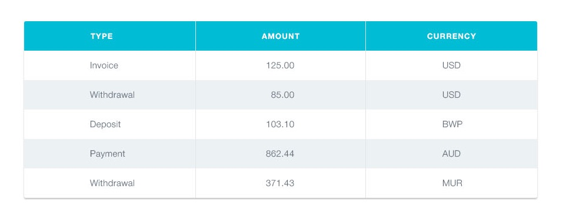

**Читати іншими мовами: [Русский](./README.md), [English](./README.en.md).**

## Історія транзакцій

---

<details>
<summary>Прев'ю компонента TransactionHistory</summary>



</details>

---

### Опис компонента

Необхідно створити компонент `<TransactionHistory>`, який приймає один проп
`items` - масив об'єктів транзакцій з `transactions.json`. Кожен об'єкт описує
одну транзакцію з наступними властивостями:

- `id` — унікальний ідентифікатор транзакції
- `type` — тип транзакції
- `amount` - сума транзакції
- `currency` - тип валюти

Компонент створює розмітку таблиці. Кожна транзакція це рядок таблиці, для
прикладу вказана розмітка двох транзакцій.

```html
<table class="transaction-history">
  <thead>
    <tr>
      <th>Type</th>
      <th>Amount</th>
      <th>Currency</th>
    </tr>
  </thead>

  <tbody>
    <tr>
      <td>Invoice</td>
      <td>125</td>
      <td>USD</td>
    </tr>
    <tr>
      <td>Withdrawal</td>
      <td>85</td>
      <td>USD</td>
    </tr>
  </tbody>
</table>
```

---

#### Приклад використання

```js
import transactions from 'шлях/до/transactions.json';

<TransactionHistory items={transactions} />;
```
